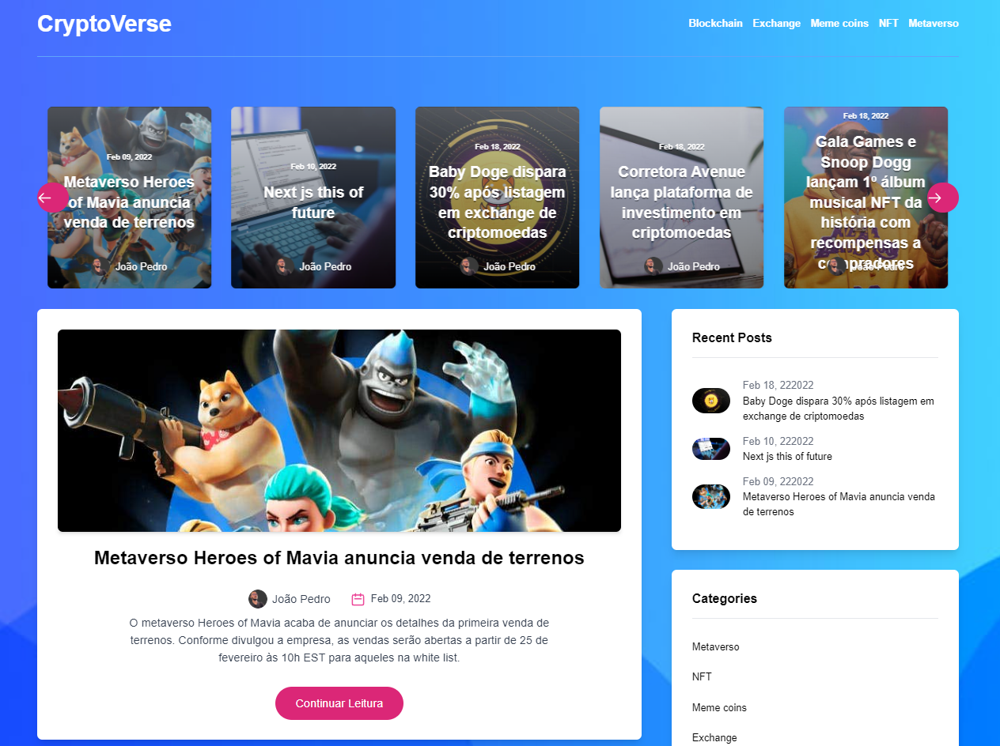

<h1 align="center">Cryptoverse

<p align="center">
  

  

  
  <a href="https://github.com/DevJPVR/cryptoverse/commits/master">
    
  </a>
    
   
   <a href="https://github.com/DevJPVR/cryptoverse/blob/main/LICENSE">


  <a href="#">
    
  </a>
  

 
</p>


<h1 align="center">
    
</h1>


<br>

## 🧪 Tecnologias

Esse projeto foi desenvolvido com as seguintes tecnologias:

- [NextJS](https://nextjs.org)
- [GraphCMS](https://graphcms.com/)
- [GraphQL](https://graphql.org/)
- [TailwindCSS](https://tailwindcss.com/)

## 🚀 Como executar

Clone o projeto e acesse a pasta do mesmo.

```bash
$ git clone https://github.com/DevJPVR/cryptoverse.git
```

Para iniciá-lo, siga os passos abaixo:
```bash
# Instalar as dependências
$ yarn
# Iniciar o projeto
$ yarn start
```
O app estará disponível no seu browser pelo endereço http://localhost:3000.


## 💻 Projeto

Portal de notícias sobre criptomoedas, em modelo de blog, desenvolvido com as mais recentes e modernas tecnologias. Utilizei NextJS no projeto, por ser escalável, pela questão de SEO, e o principal motivo: rotas dinamicas, static generation. Para fazer postagens de conteúdo no blog, utilizei o CMS GraphCMS, gostei muito de trabalhar com esse CMS, é muito prático, e moderno. E para fazer fetching de dados, utilizei o GraphQL, venho aprimorando os meus conhecimentos com essa Query Language, pois acho uma maneira muito prática e eficaz para fetching de dados com ela. Para fazer deploy da aplicação, utilizei a vercel, por ser muito relevante no mercado, oferece melhor suporte para nextjs, variáveis ambientes, boa integração com o github.

Link para testar: https://cryptoverse-bay.vercel.app/

## 📝 License

Esse projeto está sob a licença MIT. Veja o arquivo [LICENSE](https://github.com/DevJPVR/cryptoverse/blob/main/LICENSE) para mais detalhes.

---

Feito com 💜 by JoãoPedro
